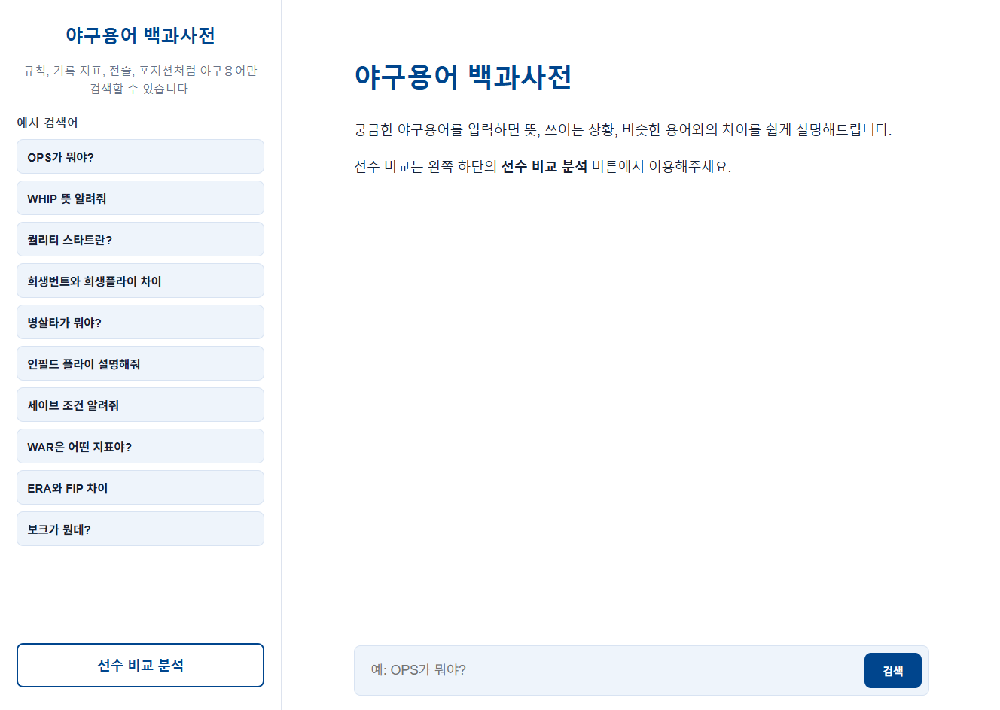
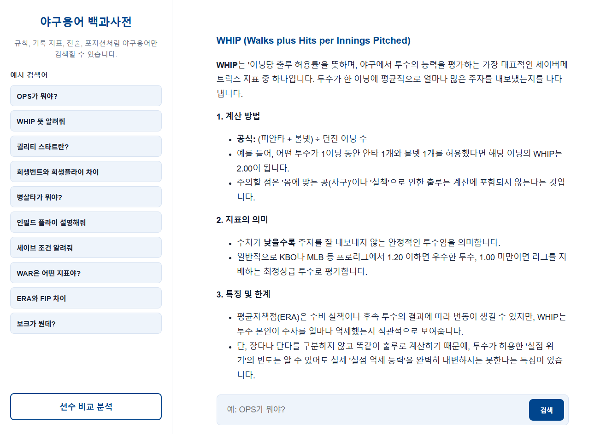
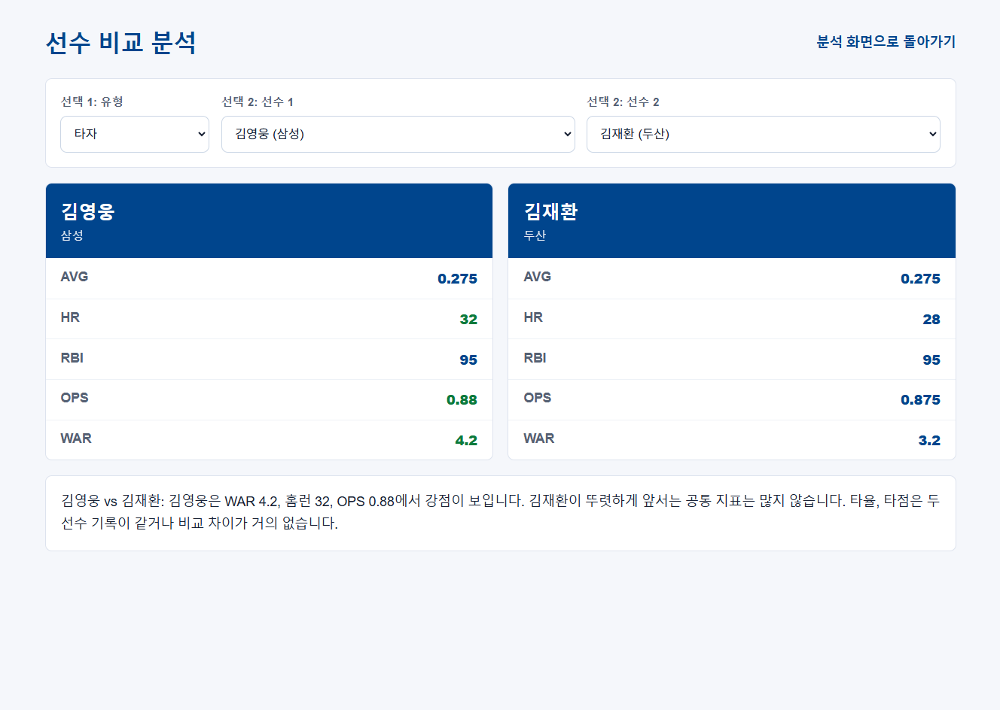
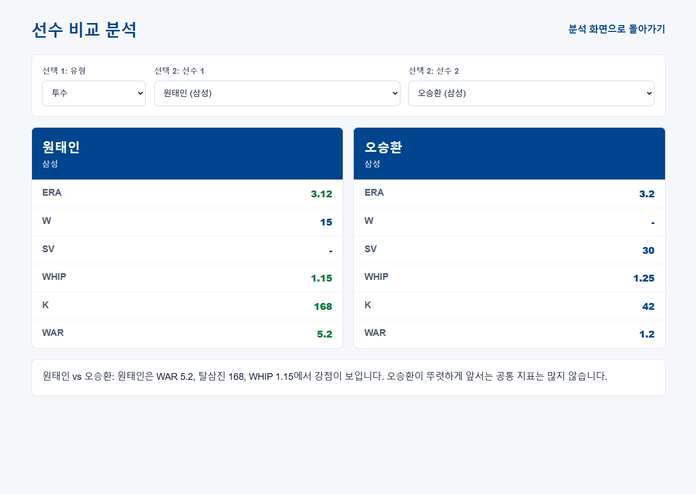

# 야구용어 백과사전 & 선수 비교 분석

Flask 기반의 야구용어 검색 웹 애플리케이션입니다.  
야구 규칙, 기록 지표, 전술, 포지션처럼 헷갈리기 쉬운 야구용어를 검색할 수 있고, 별도 화면에서 KBO 선수 기록을 비교할 수 있습니다.

## 화면 미리보기

### 1. 야구용어 백과사전 메인

궁금한 야구용어를 입력하기 전 기본 화면입니다. 왼쪽에는 자주 묻는 예시 검색어가 있고, 하단의 `선수 비교 분석` 버튼으로 비교 화면에 이동할 수 있습니다.

### 2. 야구용어 검색 결과

예시 검색어 또는 직접 입력한 질문을 바탕으로 Gemini API가 야구용어를 쉽게 설명합니다.

### 3. 타자 비교 분석

타자 유형을 선택한 뒤 두 선수를 고르면 AVG, HR, RBI, OPS, WAR 등 주요 지표를 나란히 비교합니다. 더 우세한 기록은 초록색으로 강조됩니다.

### 4. 투수 비교 분석

투수 유형을 선택하면 ERA, W, SV, WHIP, K, WAR 등 투수 지표를 비교할 수 있습니다.

> 위 이미지 파일은 `docs/images/` 폴더에 다음 이름으로 저장해두면 README에서 바로 표시됩니다.
>
> - `dictionary-main.png`
> - `dictionary-result.png`
> - `compare-batters.png`
> - `compare-pitchers.png`

## 주요 기능

### 야구용어 백과사전

- OPS, WHIP, WAR, 보크, 인필드 플라이 등 야구용어 질문 가능
- Gemini API를 이용한 한국어 설명 생성
- 예시 검색어 버튼으로 빠른 질문 입력
- 선수 이름이 포함된 질문은 선수 비교 화면 이용 안내

### 선수 비교 분석

- 투수 / 타자 유형 선택
- `players_data.json`에 저장된 선수 데이터 기반 비교
- 두 선수의 주요 기록을 카드 형태로 표시
- 더 좋은 기록을 초록색으로 강조
- 비교 결과를 문장으로 요약

## 기술 스택

- Python
- Flask
- HTML / CSS / JavaScript
- Gemini API
- JSON 기반 선수 데이터

## 사용 흐름

1. `python app.py`로 Flask 서버를 실행합니다.
2. `http://127.0.0.1:5000`에 접속합니다.
3. 메인 화면에서 야구용어를 검색합니다.
4. 선수 기록 비교가 필요하면 왼쪽 하단의 `선수 비교 분석` 버튼을 누릅니다.
5. 비교 화면에서 투수 또는 타자를 선택한 뒤 두 선수를 골라 기록을 비교합니다.

## 참고

- `.env`는 `.gitignore`에 포함되어 Git에 올라가지 않습니다.
- 선수 비교 데이터는 `players_data.json`을 기준으로 표시됩니다.
- Gemini API 키가 없거나 잘못되면 용어 검색 응답에서 API 관련 오류가 표시될 수 있습니다.
